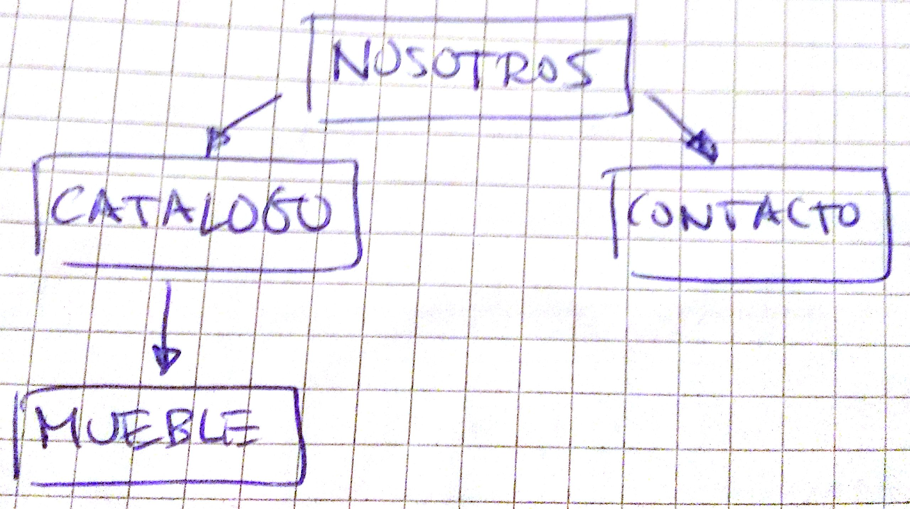
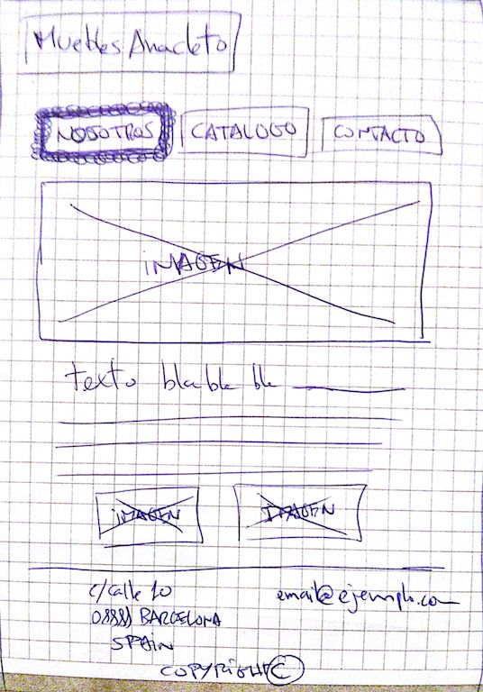
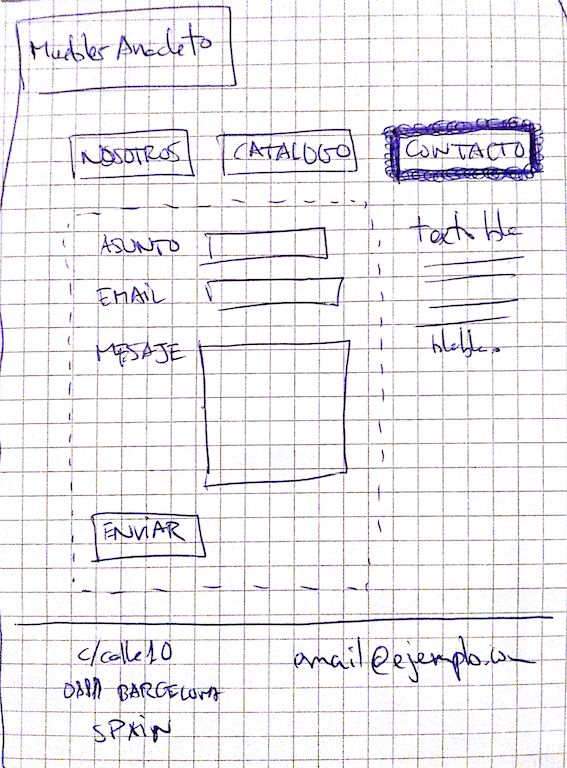
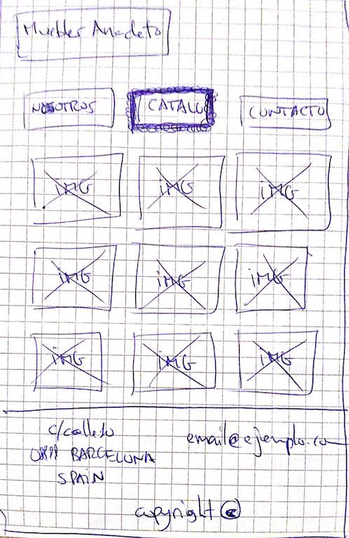
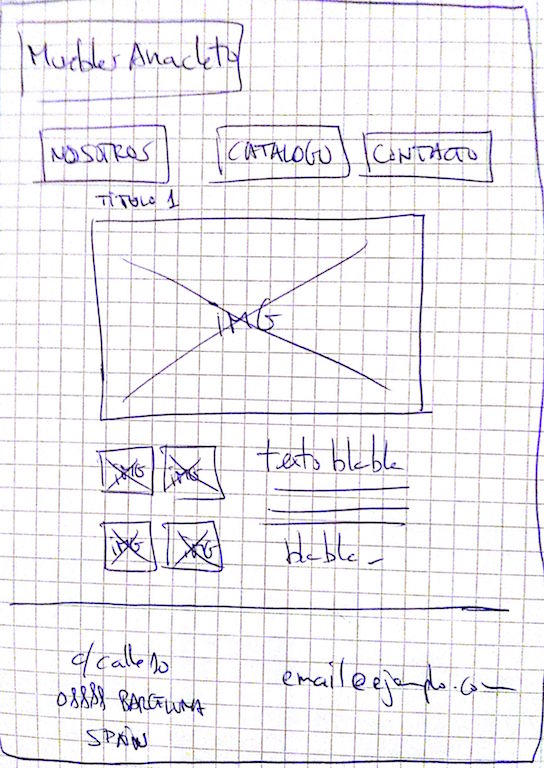

# Ejercicio 2

## Objetivos

* Aprender HTML5 y CSS3
* Aprender a maquetar imágenes en cuadriculas
* Menús navegable, aprender a enlazar páginas
* Enlazar a emails de la forma correcta
* Construir formularios
* Organización correcta de ficheros y carpetas
* Validación del código entregado
* Trabajar con fotografías de stock
* Aprender a maquetar fuentes (tipografías)
* Responder a: ¿Qué es una imagen con marca de agua? ¿Para que sirve?
* Responder a: ¿Qué es un banner? ¿Para que sirve?
* Responder a: ¿Qué es un framework de frontend? ¿Para que sirve?

## Instrucciones

Debéis construir una página web básica para una empresa de muebles. La tienda se llamará "Muebles Anacleto" y el diseño del logo es voluntario. El objetivo principal de esta empresa es tener visibilidad en Internet y para esto hay los siguientes apartados:

* Nosotros: Caída principal del visitante (o usuario). Esta incluye la descripción de la empresa y banners publicitarios.
* Catalogo: Listado de muebles en formato cuadricula 3x3. El clickar sobre un mueble de la cuadricula nos debe llevar a la vista individual del mueble (mueble.html)
* Contacto: Formulario básico de contacto con Muebles Anacleto. Este no debe funcionar, con que este maquetado correctamente ya basta.

Recordaros también:

* Debéis usar un mínimo de dos fuentes para la maquetación.
* El menú de navegación deberá indicar en que página nos encontramos como se muestra en los diagramas.

## Arquitectura deseada

Esta es la arquitectura de páginas deseada. 

Deberá incluir los siguientes ficheros:

* nosotros.html
* contacto.html
* catalogo.html
* mueble.html
* aquellos ficheros *.css necesarios
* estructura de ficheros y carpetas organizada y lógica

### Nosotros

### Contacto

### Catálogo

### Mueble

Detalle de un único  mueble.

## Herramientas

### Para crear la ARQUITECTURA y MAQUETACIÓN podéis usar

* HTML5 + CSS3
* Framework de frontend - http://getbootstrap.com/

### Para crear el CONTENIDO podéis usar

#### Imágenes

* http://www.istockphoto.com/es/
* http://www.shutterstock.com/es/

*NOTA: No hace falta comprar las imágenes. Podéis descargar y usar las imágenes con la marca de agua.*

#### Textos

* http://es.lipsum.com/

#### Fuentes

* https://www.google.com/fonts
* http://www.fontsquirrel.com/

## Ayuda

Buenos recursos online para aprender HTML5 y CSS3:

* http://www.w3schools.com/html/default.asp
* http://learn.shayhowe.com/
* http://getbootstrap.com/css/

Validación de formatos:

* https://validator.w3.org/
* https://jigsaw.w3.org/css-validator/
