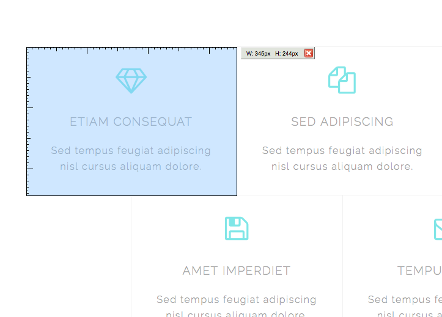

# Ejercicio 3

## Objetivos

* Aprender maquetar HTML5 y CSS3 al pixel (o pixel perfect)
* La importancia de las dimensiones
* Uso de fuentes como iconos
* Uso del navegador Firefox y los add-ons para expandir sus capacidades

## Instrucciones

Debéis construir una página web igual a la mostrada en el apartado siguiente.

Se trata de un trabajo intenso de maquetación CSS3.

## Diseño deseado

Este es el diseño de la página deseado.

Deberá incluir los siguientes ficheros:

* index.html
* aquellos ficheros *.css necesarios
* estructura de ficheros y carpetas organizada y lógica

Como referencia para los tamaños tenemos la siguiente imagen:

Cada cuadrado es de 345 píxeles horizontales por 244 píxeles verticales.

## Recursos

* La carpeta [*recursos*](./recursos) incluida en esta página.
* http://fontawesome.io/
* https://www.google.com/fonts/specimen/Raleway
* https://unsplash.com/

## Herramientas

[Add-ons](https://addons.mozilla.org) para el navegar [Firefox](https://www.mozilla.org/es-ES/firefox/products/)

* https://addons.mozilla.org/en-US/firefox/addon/measureit/
* https://addons.mozilla.org/en-US/firefox/addon/web-developer/
* https://addons.mozilla.org/en-US/firefox/addon/colorzilla/
* https://addons.mozilla.org/en-US/firefox/addon/firebug/

## Ayuda

Validación de formatos:

* https://validator.w3.org/
* https://jigsaw.w3.org/css-validator/

Otros recursos:

* http://www.w3schools.com/html/default.asp
* http://learn.shayhowe.com/
* http://es.lipsum.com/
* http://getbootstrap.com/css/
* http://www.istockphoto.com/es/
* http://www.shutterstock.com/es/
* https://www.google.com/fonts
* http://www.fontsquirrel.com/
