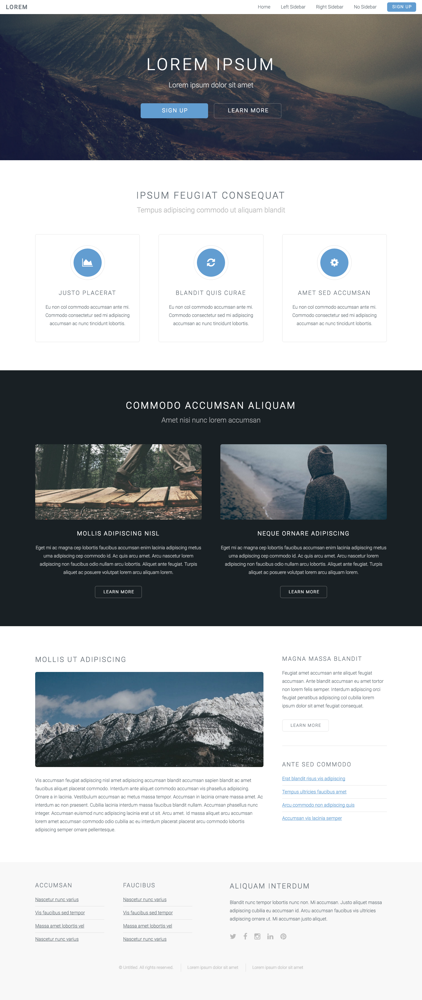
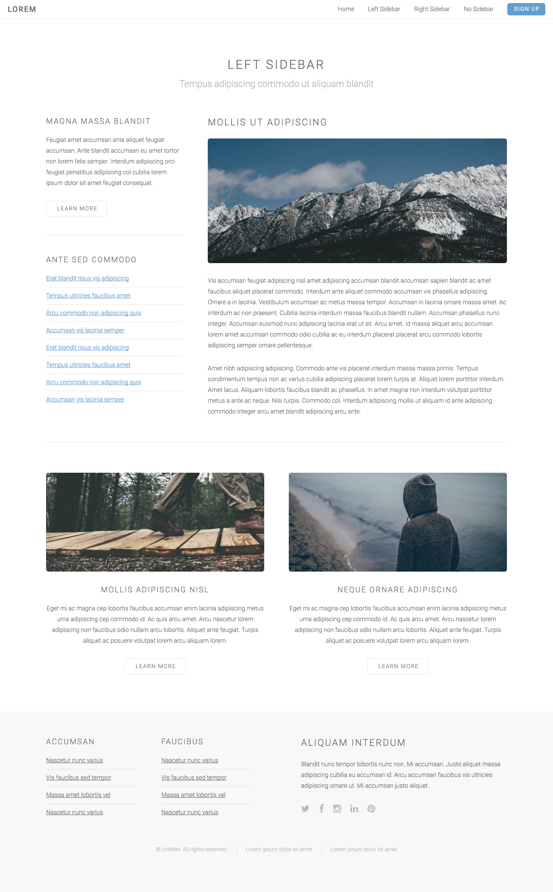
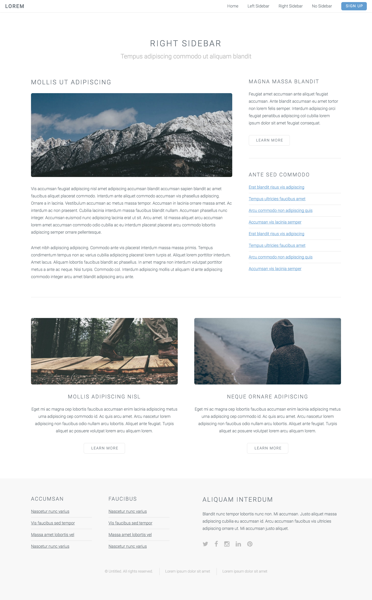
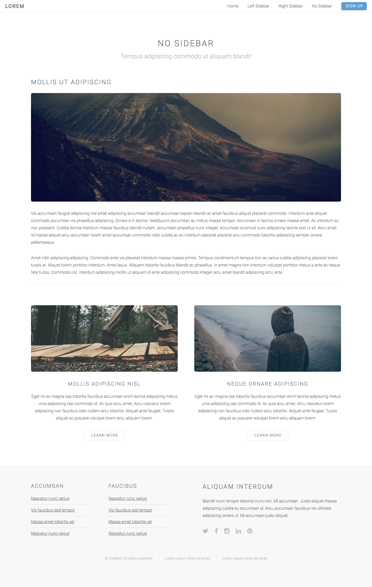
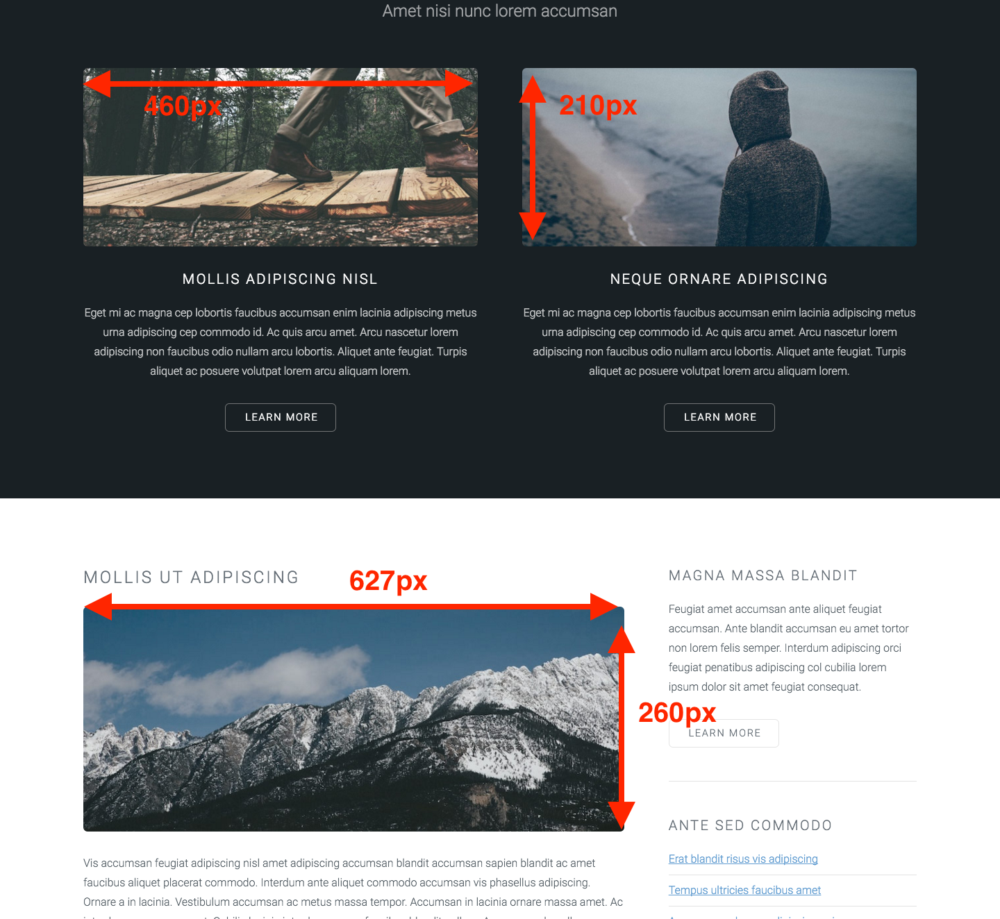

# Ejercicio 4

## Objetivos

* Aprender maquetar HTML5 y CSS3 al pixel (o pixel perfect)
* La importancia de las dimensiones
* Uso de fuentes como iconos
* Uso del navegador Firefox y los add-ons para expandir sus capacidades

## Instrucciones

Debéis construir una página web igual a la mostrada en el apartado siguiente.

Se trata de un trabajo intenso de maquetación CSS3.

## Diseño deseado

Deberá incluir los siguientes ficheros:

* index.html
* left-sidebar.html
* right-sidebar.html
* no-sidebar.html
* aquellos ficheros *.css necesarios
* estructura de ficheros y carpetas organizada y lógica
* usar los ficheros de la carpeta [*fonts*](./recursos/fonts)

Este es el diseño de la página deseado.

### Home

[](01-Home.png)

### Left Sidebar

[](02-Left_Sidebar.png)

### Right Sidebar

[](03-Right_Sidebar.png)

### No Sidebar

[](04-No_Sidebar.png)

## Recursos

* La carpeta [*recursos*](./recursos) incluida en esta página.
* Como referencia para los tamaños tenemos la siguiente imagen:

[](size_reference.png)

### Fonts

* http://fontawesome.io/
* Otras posibilidades:

```css
font-family: "Roboto", Helvetica, sans-serif;
font-family: "Courier New", monospace;
font-family: sans-serif;
font-family: monospace;
```

## Ayuda

Validación de formatos:

* https://validator.w3.org/
* https://jigsaw.w3.org/css-validator/

Otros recursos:

* http://www.w3schools.com/html/
* http://learn.shayhowe.com/
* http://www.tutorialspoint.com/
* http://es.lipsum.com/
* http://getbootstrap.com/css/
* http://www.istockphoto.com/es/
* http://www.shutterstock.com/es/
* https://www.google.com/fonts
* http://www.fontsquirrel.com/
* https://addons.mozilla.org
* http://fontawesome.io/
* https://unsplash.com/
