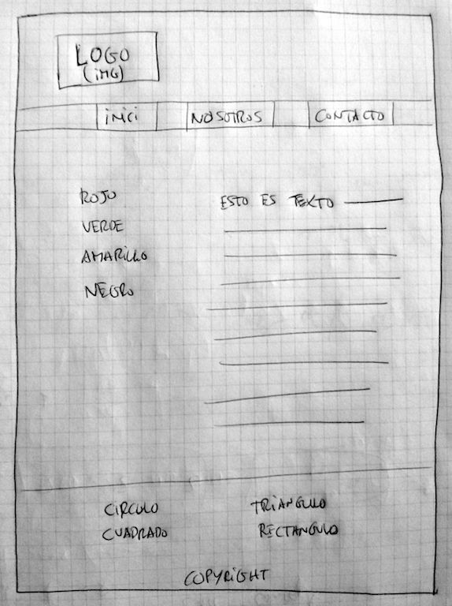

# Ejercicio 1

## Instrucciones

La idea principal es construir una página web básica y así descubrir las tecnologías:

* HTML5 - http://www.w3schools.com/html/html5_intro.asp
* CSS3 - http://www.w3schools.com/css/css3_intro.asp

Para esto deberéis crear un fichero index.html con los ficheros *.css que necesitéis.

Deberéis estructurar correctamente los ficheros y carpetas. También deberéis validar el formato de vuestra codificación.

## Arquitectura deseada

Este diagrama ilustra el esqueleto básico deseado. Este esta compuesto de:

* Un logo superior
* Una barra de navegación superior
* Una barra lateral de navegación
* El cuerpo principal
* Un pie de página

## Herramientas

### Para crear el esqueleto podéis usar

* Opción 1: HTML5
* Opción 2: Framework HTML5 como http://getbootstrap.com/

### Para crear el contenido podéis usar

#### Imágenes

* Opción 1: Tus imágenes personalizadas.
* Opción 2: http://fakeimg.pl/
* Opción 3: http://placehold.it/

#### Texto

* Opción 1: Tu texto personalizado.
* Opción 2: http://es.lipsum.com/

## Ayuda

Buenos recursos online para aprender HTML5 y CSS3:

* http://www.w3schools.com/html/default.asp
* http://learn.shayhowe.com/

Validación de formatos:

* https://validator.w3.org/
* https://jigsaw.w3.org/css-validator/

¿Cómo organizar un proyecto web?

* https://geekytheory.com/estructura-de-un-proyecto-web/
* http://appcropolis.com/es/web/como-organizar-archivos-html-css-javascript/
